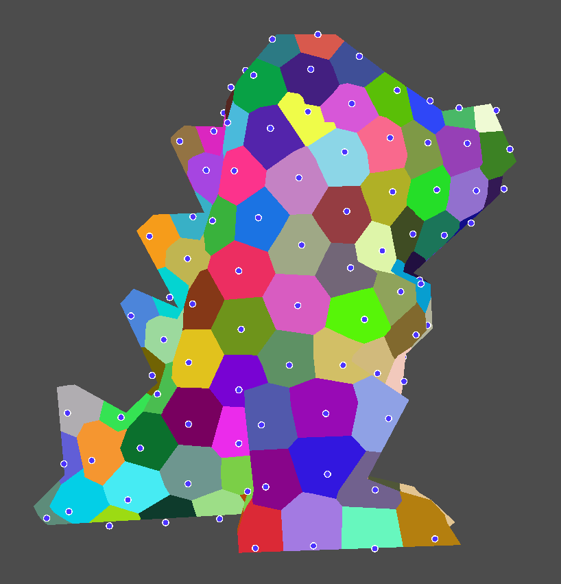
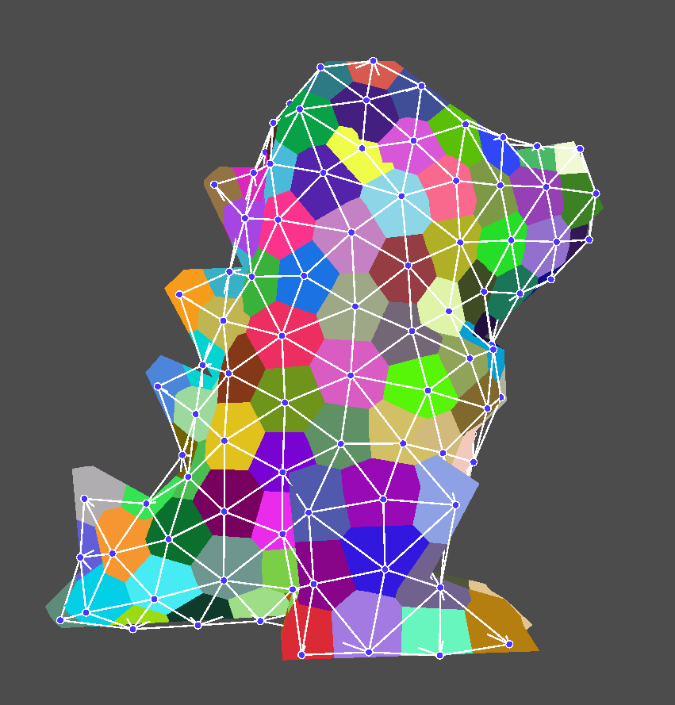

# Raster2Mesh *origins*

This project demonstrates a fun and intriguing approach to rasterize anything towards a mesh, using only GPU pixel shaders and rasterization on OpenGL 4.2. This is performing a [CVT remeshing](https://hal.inria.fr/inria-00547790/document) on the fly, building mesh topology and triangles in a GPU-friendly iterative process. The only value read back onto the CPU is the final triangle count! In a way this implements a 'mesh render target'.

With my colleagues Jonàs Martínez and Frédéric Claux, we at some point [tried to turn this idea into a publication](https://hal.inria.fr/hal-01117655) but unsuccessfully so. The code released here is the most simple version, my early prototype without any of the refinements described in the tech report above. However, I find this version much truer to the initial spirit of the project, which was to demonstrate an intriguing possibility of meshing from pixel shaders.

Instead of letting the code rot on my hard drive, I though it would be much better to release it to the world (BSD 2-clause license).

> **Note.** Let's be clear, we're here to have fun and consider an intriguing approach. This is not the best, not the most accurate, and not even the fastest way to remesh something **(1)**. If you're still interested -- I hope you are -- read-on and enjoy! I promise this is quite unique and if you like GPU and pixel shaders you're likely to be interested.

> **(1)** For an in-depth overview of meshing I recommend [this book](http://www.pmp-book.org/) ; see also links at the end of this page.

## How to try?

```
git clone --recurse-submodules https://github.com/sylefeb/raster2mesh.git
cd raster2mesh
mkdir BUILD
cd BUILD
cmake ..
make
./src/raster2mesh ../totodile.stl
```

## Principle

**Input:** Whatever surface that can be rasterized, in this demo the input is a mesh to remesh, that could be a raytraced implicit, voxels, a (dense) point set, etc.

**Output:** An indexed triangle mesh, with a controlled triangle budget and high quality triangles. Depending on the input, your luck with random seeds, and given sufficent triangles it may even be a closed watertight mesh. Perhaps.

I am next assuming that you are familiar with what a *Voronoi diagram* is. If not, [time to investigate](https://en.wikipedia.org/wiki/Voronoi_diagram), these are fascinating and important across many, many fields.

I'll try to make this explanation as straightforward and simple as possible, so if you're an expert please excuse the hand waving approach. For an accurate description and a much more advanced (yet approachable) technique, I refer the interested reader to [*Isotropic Remeshing with Fast and Exact Computation of Restricted Voronoi Diagram*](https://hal.inria.fr/inria-00547790/document) by Yan et al.

So what is this Voronoi diagram that we need? We start from a set of 3D points located close to the surface, which I'll call *centroids*. We will determine which centroid is the closest to any given surface point. This is illustrated below, where the surface is colored depending on which centroid is closest to each surface point. This reveals the cells of a 3D Voronoi diagram intersecting the surface, with the centroids shown as blue-white dots.



A quick word on how this image is computed: The centroids are stored in a 3D grid enclosing the object. From the pixel shader used to draw the surface we lookup into the grid searching for the centroid closest to the point being shaded. Because there are many centroids compared to the grid size, we do not look more than a 1-ring neighborhood in the grid to find the closest. This is performed in `sh_raster.fp` by `findClosest` called from the code below:

```c
// search a 1-ring in the grid
for (int i = -1; i <= 1; ++i) {
  for (int j = -1; j <= 1; ++j) {
    for (int k = -1; k <= 1; ++k) {
      findClosest(ijk + ivec3(i, j, k), p, mind, mini, minc);
    }
  }
}
```
The grid is a 3D array flattened in buffer `Grid`, which contains two values per entry: a start index in a second buffer (`GridData`), and a number of contained centroids. The second buffer stores the list of centroids enclosed within each 3D grid entry. So to go through all centroids in a cell, we fetch the index and number of entries from `Grid` and iterate, reading data from `GridData`. Here is the loop in `findClosest`:
```c
// for each centroid in this grid entry
int ptr   = int(imageLoad(u_Grid, entry * 3 + 2).x);
int num   = int(imageLoad(u_Grid, entry * 3 + 1).x);
for (int i = 0; i < num; i++) {
  vec3 ctr;
  ctr.x = imageLoad(u_GridData, (ptr + i) * 4 + 0).x;
  ctr.y = imageLoad(u_GridData, (ptr + i) * 4 + 1).x;
  ctr.z = imageLoad(u_GridData, (ptr + i) * 4 + 2).x;
  int id = int(imageLoad(u_GridData, (ptr + i) * 4 + 3).x);
  ...
```
The grid is rebuilt whenever the centroid positions are updated. This is done by `sh_store.fp` after the data structures have been zeroed.

Now, we need to make the Voronoi diagram as 'regular' as possible, trying to obtain evenly sized cells. Later on, the triangles will be built from the cells ; so the more regular they are, the prettier our triangles. How do we do that? We iterate in a process called the [Lloyd algorithm](https://en.wikipedia.org/wiki/Lloyd%27s_algorithm). This is a clever, simple idea: at each iteration we move the centroid onto the 'center' of its cell, that is the average coordinate of the surface points within the cell.

How is this computed from pixel shaders? Well *that*, is the first trick.

> **Note:** I am taking a very relaxed approach in these explanations. As an aside let me add some more specific details: we are computing a Centroidal Voronoi Tesselation (CVT) from a Restricted Voronoi Diagram (RVD) on the surface. For all details [look here](https://hal.inria.fr/inria-00547790/document). The paper also introduces a much faster CVT computation.

Using shader arbitrary load/stores we can perform the Llyod process *during rendering*. As we rasterize our object in a render target, we simultaneously gather the sum of surface point coordinates falling into each centroid cell. We pre-allocate a buffer `AccumCenter` with one entry per centroid and accumulate the sum of coordinates in this buffer, through an *imageAtomicAdd*. This is done in `sh_raster.sh` after identifying the centroid for the surface point:

```c
imageAtomicAdd(u_AccumCenter, mini * 4 + 0, uint(p.x * float(1 << 16)));
imageAtomicAdd(u_AccumCenter, mini * 4 + 1, uint(p.y * float(1 << 16)));
imageAtomicAdd(u_AccumCenter, mini * 4 + 2, uint(p.z * float(1 << 16)));
imageAtomicAdd(u_AccumCenter, mini * 4 + 3, uint(1));
```
where `mini` is the id of the centroid closest to the surface point being shaded. The multiplier `* float(1 << 16)` allows to use integer atomic operations by converting to a fixed point representation. This can overflow if too many coordinates are accumulated, but back in 2013 [atomic floating point operations](https://www.khronos.org/registry/OpenGL/extensions/NV/NV_shader_atomic_float.txt) where not a thing!

Once the object entirely rasterized, we compute the average to obtain the new location of the centroids (`sh_update.fp`). This process iterates continuously in the background.

> **Note:** To ensure the input is well sampled we render three orthographic views. When the input is a mesh, a geometry shader `sh_raster.gs` discards triangles which are not well aligned with the view, so that an input triangle appears in a single view.

This gives us the well distributed centroids. Now where do the triangles come from? Have a look at the Figures below.

&nbsp;&nbsp;


The triangles are built using the centroids as the vertices, creating one triangle for every corner shared between three cells **(2)**. This is called the *dual* triangulation.

> **(2)** That is the most typical case, but rare cases of corners shared by more than three cells can occur, especially with our rasterization approach. The code deals with the four-cells case (diamonds) but no more. Holes will appear in larger cases.

In practice we do not track corners but neighboring cells of the diagram, noting there is one triangle edge whenever two cells are neighboring. How can we detect neighboring cells? Well *that* is the second trick.

The trick is to track neighboring cells while we rasterize the input model, in the same pass as the one where we accumulate coordinates. This is easy to do, because as we search for the closest centroid, we might as well track the second closest (see `findTwoClosests` in `sh_raster.fp`). This gives us two distances, and if these two distances are very similar (same within a tolerance), then we are close to a diagram edge. This is performed by the following in `sh_raster.fp`:

```c
// check for connectivity
if (abs(mind - mind1) < BORDER && mini1 != mini) {
    // close enough! => insert in set
    insertInSet(mini, mini1);
    insertInSet(mini1, mini);
}
```
where `BORDER` is a 'well chosen' threshold ('well chosen' means 'tweak until it works' :) but in practice I rarely had to modify this value. If too small there is a risk to miss and edge, if too large we are putting more pressure on the inserter, see next).

Note the calls to `insertInSet`. Each centroid has a small array of `16` entries (as defined in `raster2mesh.cpp` by `#define CONNECT_NUM_ENTRIES 16`, the arrays are stored in the buffer `Connect`). `insertInSet` goes through this small list, checks if the value is already there and if not inserts it. This works through atomic operations, as of course many pixel shader threads are concurrently inserting in the same list! Here's the code making this work:

```c
void insertInSet(int id_host, int id_to_insert)
{
  int  start = id_host * u_ConnectNumEntries; // assumes this is large enough
  uint id = uint(id_to_insert) + 1;
  int iter = 0;
  while (iter < u_ConnectNumEntries) {
    uint v = imageAtomicMax(u_Connect, start + iter, id);
    if (v == 0 || v == id) {
      break;
    } else if (v < id) {
      id = v;
    }
    iter++;
  }
}
```
As you can see this is based on an atomic max. Whenever atomic max is called, either the value we insert is larger and replaces the previous one, or it is not inserted. Either case the returned value is inserted further, *unless* `v == 0 || v == id`. In that case the slot was either empty (0 indicates empty) or the same value was already there, so we stop (`break`). Because the max is an atomic operation, this is guaranteed to work through concurrent insertion.

After this process, we have in `Connect` the list of neighbors for each centroid. Each neighbor implies that a triangle edge should exist between the two centroids in the result.

We are now ready to actually construct the final mesh triangles! This is done by `sh_gentris.fp`.

This shader is invoked once per centroid (rendering a quad of appropriate size). It goes through the neighbors of the centroid, and checks whether all edges that would produce a triangle exist. Let's be a bit more precise: I'll call the centroid being considered *c0*. If *c0* has a neighbor *c1*, then we check whether both *c0* and *c1* have another neighbor *c2* in common. If yes, a triangle *<c0,c1,c2>* is created.
There is an obvious caveat here: we may end up creating the triangle three times, since the shader is invoked on all three centroids. We avoid this by only emitting a triangle if the index of *c0* (in the `Centroids` array) is smaller than that of *c1*, and similarly the index of *c1* is smaller than that of *c2*. Triangles are triples written into the `Triangles` buffer, using an atomic increment to reserve a slot. The code is in `sh_gentris`:

```c
if (id0 < id1 && id1 < id2) {
  // insert the triangle
  uint ptr = imageAtomicAdd( u_Counter, 0, 1u );
  imageStore(u_Triangles, int(ptr*3+0), uvec4(id0));
  imageStore(u_Triangles, int(ptr*3+1), uvec4(id1));
  imageStore(u_Triangles, int(ptr*3+2), uvec4(id2));
}
```

And that's it! (mostly ...). Now we can remesh from pixel-shaders anything that can be rasterized and ends up invoking `sh_raster`!

A last question is how to render the resulting mesh. The triangle indices and vertex coordinates are respectively in buffers `Triangles` and `Centroids`. We render the result by instantiating a single triangle as many time as there are triangles in the result, and use a vertex shader to position it, see `sh_mesh.vp`. The triangle count for instantiation is the only thing read back from the GPU, and this could likely be avoided on more recent APIs.

> **Note:** There are a few other technicalities in the code that I do not describe here for the sake of keeing things short and to the point. I'm happy to answer questions and feedback is welcome, feel free to open issues asking for clarifications.

## Limitations
-  The approach tends to produce non-manifold meshes near sharp/narrow features especially if triangles are large wrt. such features.
- Triangles are not oriented, so if the mesh is saved this may become an issue depending on your application.
- Accumulation of coordinates can overflow when using few centroids. Conversely with too many centroids the sampling becomes too low to produce a good diagram.
- Co-circular cases beyond four are not dealt with, holes will appear.
- The grid uses copious amounts of memory, a sparse structure (octree, hash) would be much better.

Several of these issues are addressed in [our technical report on the topic](https://hal.inria.fr/hal-01117655).

## Further reading

Interested in CVT on the GPU? See our latest works on the topic:
- [Restricted Power Diagrams on the GPU, Basselin et al., 2021](https://hal.archives-ouvertes.fr/hal-03169575).
- [Meshless Voronoi on the GPU, Ray et al., 2019](https://hal.inria.fr/hal-01927559).

For state of the art remeshing see the Geogram library by Bruno Levy:
- [Geogram main page](http://alice.loria.fr/software/geogram/doc/html/index.html)

## Credits

- [Low poly Totodile by flowalistic](https://www.thingiverse.com/thing:341719).
